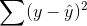
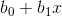
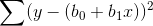

This is the derivation of both the closed form and gradient descent solution of linear regression

RSS is simply the squared difference between target  and estimated value .

Remember that  is equal to  so we can expand this further into:

https://gist.github.com/amajidsinar/6c81fff7944805db6d9769bbf5b4cfb6